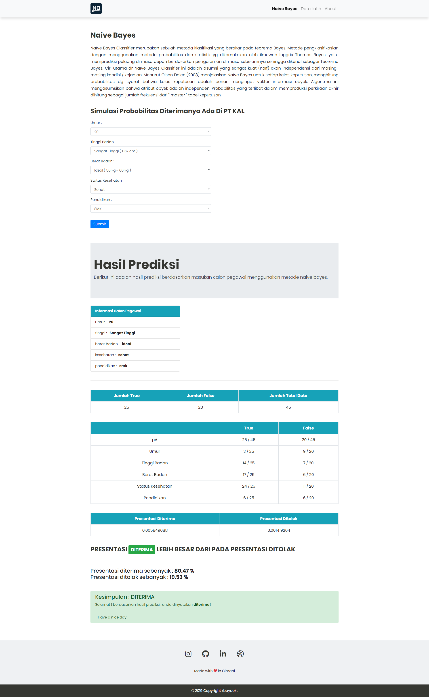
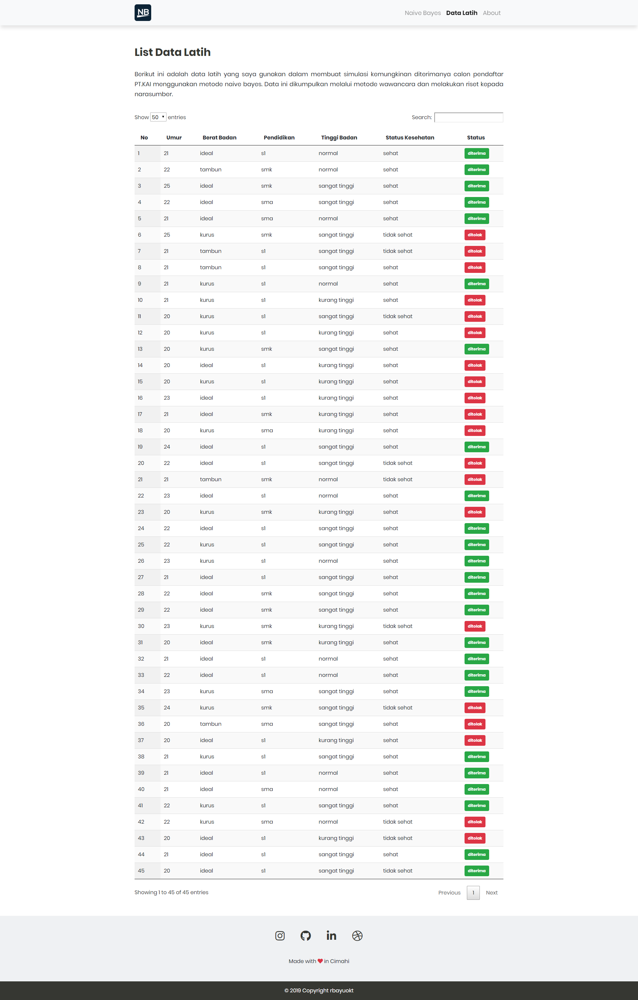
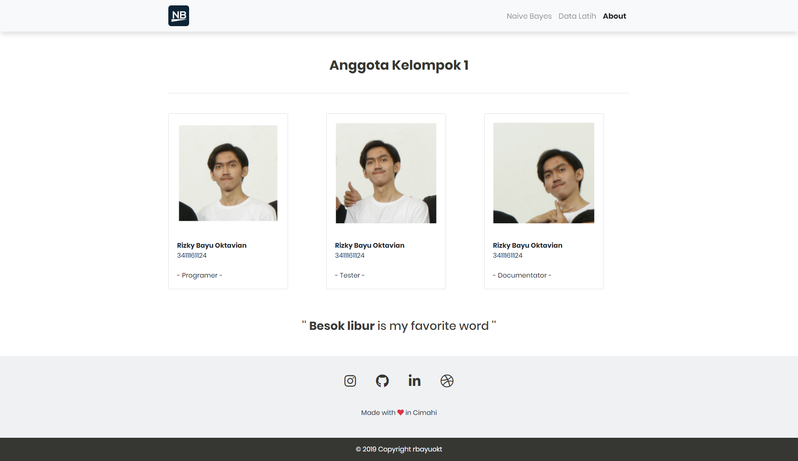

# rb-naiveBayes

Algoritma Naive Bayes merupakan sebuah metoda klasifikasi menggunakan metode probabilitas dan statistik yg dikemukakan oleh ilmuwan Inggris Thomas Bayes. Algoritma Naive Bayes memprediksi peluang di masa depan berdasarkan pengalaman di masa sebelumnya sehingga dikenal sebagai Teorema Bayes. Ciri utama dr Naïve Bayes Classifier ini adalah asumsi yg sangat kuat (naïf) akan independensi dari masing-masing kondisi / kejadian.

# Studi kasus yang digunakan
Dalam rangka menyelesaikan mata kuliah kecerdasan buatan ini saya mengangkat sebuah kasus dan studi kasus yang saya gunakan disini adalah untuk memprediksi seberapa besar peluang diterimanya calon pegawai PT.KAI berdasarkan data - data sebelumnya yang mana data tersebut berasal dari pegawai yang sudah diterima dan pegawai yang ditolak, sehingga data tersebut dijadikan acuan untuk menjadi data latih untuk metode naive bayes ini.

# Tool yang digunakan 
1. Bootstrap 4.0
2. Font-awesome
3. Data latih dalam bentuk json
4. Jquery

# Fitur
- [x] Memprediksi probabilitas diterima / ditolaknya
- [x] No Reload Prediction
- [x] Clean Design

# Screenshoot

**Homepage** :  
Halaman untuk melakukan prediksi menggunakan naive bayes.   
  

**Data Latih** :  
Memperlihatkan data latih yang digunakan dalam bentuk tabel.  
  

**About** :  
Tentang pembuat aplikasi ini yaitu saya sendiri wkwk padahal kelompokan tapi saya yg kerjain semua :(  
  

made with :heart: in Cimahi by [@rbayuokt](https://www.instagram.com/rbayuokt/) :thumbsup:
